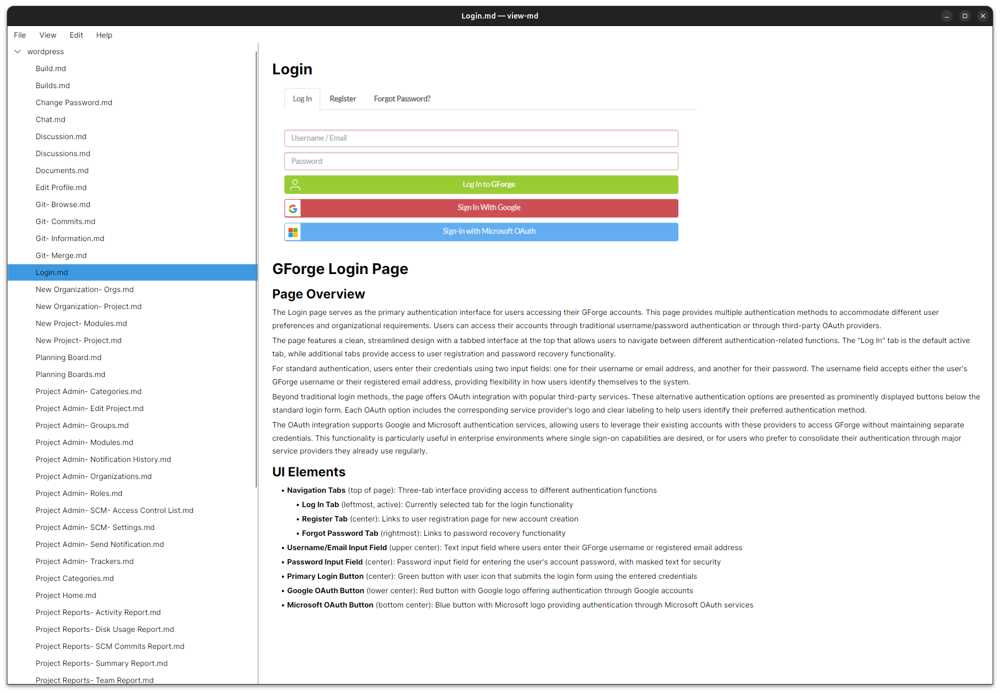

# view-md

A lightweight, fast-starting native Markdown viewer for the desktop.
Double-click a `.md` file and it opens like a text file, not a web app.

Built for Linux (primary target: Ubuntu 24.04), with Windows and macOS
builds also produced from the same codebase.

## Why

Most Linux Markdown viewers wrap a webview (Electron, or a GTK/Qt shell
around WebKitGTK). In practice that means one of three things goes wrong:

- it fails to install cleanly via `apt` or `snap`,
- it fails to *run* at all because of a WebKitGTK version mismatch, or
- it works, but takes a second or more to cold-start for something that
  should feel instant.

view-md is built to avoid all three. It renders Markdown directly into
native UI controls instead of going through an embedded browser engine or an
HTML intermediate step, so there's no webview dependency to break and no
browser engine to spin up. The goal is for opening a `.md` file in view-md to
feel as immediate as opening it in `less` or `bat`.

It's a free, single-user, offline, no-account desktop tool. There's no
backend, no telemetry, and no persistence beyond a couple of small local
config files.

## Features

- **Fast native rendering**: Markdown is parsed with [Markdig](https://github.com/xoofx/markdig)
  (CommonMark + common GFM extensions: tables, task lists, fenced code
  blocks) and rendered straight into Avalonia's Skia-based visual tree.
- **File & folder association**: launch as `view-md <path>`; a file opens
  directly, a folder opens the sidebar directory browser. Set as the
  default handler for `.md` files on Linux via `xdg-mime`.
- **Directory browser**: a collapsible sidebar tree for browsing a whole
  folder of Markdown files (docs sites, wikis, notes vaults), recursive
  into subfolders. Remembers its open/closed state and width.
- **Most-recently-used list**: recently opened files and folders are
  tracked separately and one click away from the File menu.
- **Auto-reload**: the open file (or folder tree) watches for changes on
  disk and re-renders automatically, so you can edit in another tool and
  preview live in view-md.
- **Find in document**: browser-style search over the currently rendered
  document, with highlighting and next/previous navigation (`Ctrl+F`,
  `F3`/`Shift+F3`).
- **Export to PDF**: exports the current document to a PDF that matches
  what's on screen, via SkiaSharp's `SKDocument`.
- **Image display**: standalone images render inline (relative paths,
  `file://`, and `http(s)://` URLs, the last fetched over the network with a
  5s timeout). Images mixed into a line of text render as a clickable
  `[image: alt]` link instead, due to an Avalonia text-layout limitation;
  see `.charter/decisions.md` for details.
- **Theming**: follows the OS light/dark setting automatically, with a
  manual System/Light/Dark override in Preferences.
- **Configurable typography**: font family, base font size, line-height
  multiplier, and document margin, all applied immediately and persisted.
- **Versioned builds**: the running app reports its version and git commit
  (Help → About view-md), generated automatically at build time.

## Screenshots



## Technical composition

| | |
|---|---|
| Language | C# |
| Runtime | .NET 10, [NativeAOT](https://learn.microsoft.com/dotnet/core/deploying/native-aot/) on Linux; self-contained JIT on Windows/macOS |
| UI framework | [Avalonia UI](https://avaloniaui.net/) 12.1.1 (cross-platform, Skia-based, no webview) |
| Markdown parsing | [Markdig](https://github.com/xoofx/markdig) |
| Markdown → UI rendering | Hand-rolled, first-party renderer that walks the Markdig AST and emits Avalonia controls directly (see below) |
| PDF export | SkiaSharp's `SKDocument` PDF canvas (reuses Avalonia's own SkiaSharp dependency, no extra native library) |
| Config storage | Local JSON under `~/.config/view-md/`, no database |
| File watching | `System.IO.FileSystemWatcher`, debounced |
| CI | Jenkins, single Docker-based agent, builds/tests/packages all three platforms |

A few choices are worth calling out:

- **No webview.** The renderer walks the Markdig AST and builds Avalonia
  controls (`TextBlock`, `Image`, tables, etc.) directly, instead of going
  through an HTML/browser layer.
- **First-party renderer.** At the time this was built, the obvious
  off-the-shelf option, `Markdown.Avalonia`, only had alpha-quality support
  for Avalonia 12, so a small custom renderer was written instead of taking
  a dependency on unstable code.
- **NativeAOT on Linux only.** NativeAOT can't cross-compile between
  operating systems. The Linux `.deb` build is ahead-of-time compiled (fast
  cold start, small footprint); the Windows and macOS builds are standard
  self-contained JIT publishes cross-compiled from the same Linux host.

## Installation

Pre-built packages are produced by CI and published under
[Releases](../../releases) (or build them yourself; see below).

### Linux (.deb, Ubuntu 24.04+)

```sh
sudo dpkg -i view-md_<version>_amd64.deb
xdg-mime default view-md.desktop text/markdown   # also printed by dpkg -i
```

This installs a NativeAOT self-contained binary (no separate .NET runtime
required) and registers the `.desktop` entry and MIME association.

### Windows

Unzip `view-md_<version>_win-x64.zip` and run `view-md.exe`. To register it
as an available handler for `.md` files (per-user, no admin rights), run
`register-file-association.ps1` from the unzipped folder.

> This script is written and checked against Microsoft's registry
> documentation but has not been verified on an actual Windows machine.
> Please report issues if you hit any.

### macOS

Unzip `view-md_<version>_osx-arm64.zip` and run `view-md.app`.

> This build is **unsigned** (no Apple Developer account in scope for this
> project), so Gatekeeper will block it on any Mac other than the one that
> built it. Bypass with right-click → Open, or:
> `xattr -dr com.apple.quarantine view-md.app`

## Building from source

Requires the **.NET 10 SDK**:

```sh
# Ubuntu 24.04+, from the noble-updates repo
sudo apt install dotnet-sdk-10.0
```

```sh
dotnet build                                          # compile everything
dotnet run --project src/ViewMd                       # run from source
dotnet run --project src/ViewMd -- ~/notes/README.md   # open a specific file
dotnet run --project src/ViewMd -- ~/notes             # open a folder
```

### Keyboard shortcuts

| Shortcut | Action |
|---|---|
| `Ctrl+O` | Open file |
| `Ctrl+Shift+O` | Open folder |
| `Ctrl+B` | Toggle sidebar |
| `Ctrl+F` | Find in document |
| `F3` / `Shift+F3` | Next / previous match |

### Headless smoke testing

`tools/SmokeTest` renders a given Markdown file (or folder) through the
real `App`/`MainWindow` using Avalonia's headless Skia backend and saves a
PNG. Useful for catching rendering regressions without a display attached
(this is also what CI runs as its test stage):

```sh
dotnet run --project tools/SmokeTest -- path/to/file.md out.png
dotnet run --project tools/SmokeTest -- path/to/file.md out.png out.pdf   # also exercise PDF export
```

### Packaging

Three platforms, built from one Linux host. Only the Linux build is
NativeAOT. NativeAOT cannot cross-compile between operating systems (see
`.charter/decisions.md`), so the Windows/macOS builds are standard
self-contained (JIT) publishes cross-compiled from Linux.

```sh
./packaging/build-deb.sh      # Linux, NativeAOT   -> dist/view-md_<version>_amd64.deb
./packaging/build-windows.sh  # Windows, JIT        -> dist/view-md_<version>_win-x64.zip
./packaging/build-macos.sh    # macOS, JIT + bundle -> dist/view-md_<version>_osx-arm64.zip
```

### Version

The app version lives in a single file, `version.txt`, at the repo root;
edit it to bump the version. The build stamps it together with the current
git commit's short hash (plus a `-dirty` suffix for an uncommitted working
tree) into the assembly automatically at compile time, so there's no
separate bump tooling. See it in the running app via Help → About view-md.

### CI

`Jenkinsfile` builds, tests, and packages all three platforms on a single
Docker-based agent (`mcr.microsoft.com/dotnet/sdk:10.0-noble-aot`). The test
stage runs `tools/SmokeTest` headlessly as a rendering smoke check. There's
no GUI test framework here, but this exercises the real rendering code path
without needing a display, including inside the CI container.

## Configuration

view-md stores its (small) local state under `~/.config/view-md/`:

- `mru.json`: recently opened files and folders (up to 15 of each)
- an app settings file: sidebar state/width, theme override, typography

There's no database, no cloud sync, and no telemetry.

## Project documentation

This project uses [Charter](https://github.com/mtutty/charter) as its
documentation framework. The `.charter/` directory is the source of truth
for what the app is, why it's built the way it is, and what decisions have
already been made. Read it before making changes:

- [`.charter/project-brief.yaml`](.charter/project-brief.yaml): app
  identity, stack, capability configuration
- [`.charter/capabilities/`](.charter/capabilities/): one file per
  capability (what it does, why it's configured this way, how it connects
  to the rest of the app)
- [`.charter/integrations.md`](.charter/integrations.md): how capabilities
  hand off to each other
- [`.charter/data-model.md`](.charter/data-model.md): the (small,
  file-based) data model
- [`.charter/decisions.md`](.charter/decisions.md): append-only
  architectural decision log

Note: this project's charter was hand-authored rather than generated from
Charter's standard web-SaaS reference data, because that data (Node/Python/
PHP stacks, auth/billing/multi-tenancy capabilities) doesn't apply to a
local, single-user desktop app. See the first entry in `decisions.md` for
why, and what that means for future contributions.

## Known limitations

- Mermaid diagrams and LaTeX math are not rendered (a consequence of not
  using a browser engine).
- Images inline with surrounding text (as opposed to standalone on their
  own line) render as a clickable text link rather than an embedded
  picture. This is an Avalonia text-layout limitation, not a missing
  feature; see `.charter/decisions.md`.
- Search is scoped to the currently open document, not a full-text index
  across a folder.
- The Windows file-association script is untested on real Windows hardware.
- The macOS build is unsigned and unnotarized.

## Status

Charter complete. Core capabilities implemented and verified: rendering,
MRU, directory browser, file association/CLI dispatch, auto-reload, search,
PDF export, theming (OS-follow + override), configurable typography,
versioning, and packaging for all three desktop platforms.

## License

[MIT](LICENSE)
